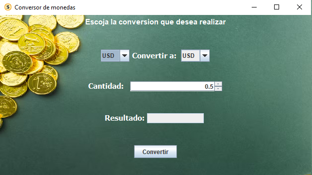
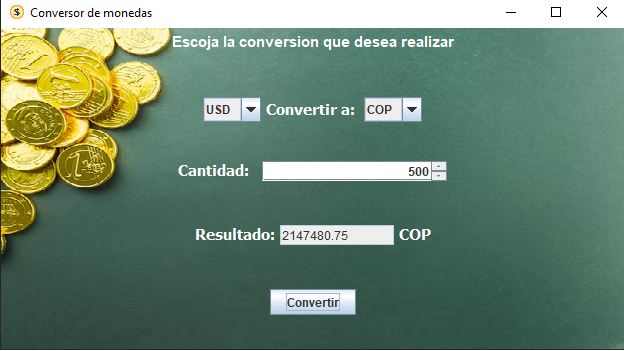

# Conversor de Monedas

Este es un proyecto de conversor de monedas desarrollado en Java. Permite a los usuarios convertir entre diferentes divisas utilizando tasas de cambio actualizadas. La aplicación tiene una interfaz gráfica que es fácil de usar y proporciona resultados instantáneos y actualizados constantemente a tiempo real a travez de consumo de una api.




## Características

- Conversión entre múltiples monedas.
- Interfaz gráfica intuitiva.
- Cálculos precisos utilizando tasas de cambio actuales.

## Tecnologías Usadas

- Java SE
- Swing (para la interfaz gráfica)
- Gson (para el manejo de JSON)

## Requisitos

- JDK 11 o superior
- Dependencias:
  - Gson (incluye la biblioteca en tu proyecto)

## Instalación

1. Clona este repositorio en tu máquina local:

   ```bash
   git clone https://github.com/carlosoo7/Conversor_Monedas_api.git
   ```

2. Navega a la carpeta del proyecto:

   ```bash
   cd conversor-monedas
   ```

3. Abre el proyecto en tu IDE favorito (como IntelliJ IDEA o Eclipse).

4. Asegúrate de tener las dependencias necesarias, como Gson, en tu proyecto.

## Uso

1. Ejecuta la aplicación:

   ```bash
   javac src/app/*.java
   java app.AplicacionDeEscritorio
   ```

2. La aplicación abrirá una ventana donde podrás:
   - Seleccionar la moneda que deseas convertir.
   - Elegir la moneda a la que deseas convertir.
   - Ingresar la cantidad a convertir.
   - Hacer clic en el botón "Convertir" para ver el resultado.

  
Resultado



## Estructura del Código

El código está organizado de la siguiente manera:

- **app/AplicacionDeEscritorio.java**: Clase principal que inicia la aplicación y configura la ventana.
- **app/Lamina.java**: Clase que define el panel principal y los componentes de la interfaz gráfica.
- **app/Moneda.java**: Clase que representa la estructura de los datos de las monedas, utilizando Gson para manejar el JSON.
- **app/listaDeMonedas.java**: Clase que almacena las monedas disponibles para conversión.

### Ejemplo de Código

Aquí hay un ejemplo de cómo se configura un `JLabel` con color y tamaño de letra:

```java
JLabel titulo = new JLabel("Conversor de monedas");
titulo.setFont(new Font("Arial", Font.BOLD, 16));
titulo.setForeground(Color.BLUE);
```

Ejemplo de consulta con httprequest
```java
 URI direccion = URI.create("https://v6.exchangerate-api.com/v6/apikey/latest/" + Monedaconsulta);
        HttpClient client = HttpClient.newHttpClient(); //client y request encargados de ejecutar la consulta
        HttpRequest request = HttpRequest.newBuilder().uri(direccion).build();

        try {
            HttpResponse<String> response = client
                    .send(request, HttpResponse.BodyHandlers.ofString());
            Moneda moneda = new Gson().fromJson(response.body(), Moneda.class); //Objeto del tipo moneda que guardara el json con las conversiones
            Double valorconvercion=moneda.conversion_rates().get(Conversion); //llamado del valor a coinvertir solicitado
            return valorconvercion * valor; //return del valor solicitado por la cantidad que se desea convertir
        } catch (InterruptedException | IOException e) {
            JOptionPane.showMessageDialog(null,"Error en la ejecucion de conversion, intente mas tarde"); //en caso de error de consulta  salta mensaje
            throw new RuntimeException("Error en la ejecucion de conversion");
        }
```


